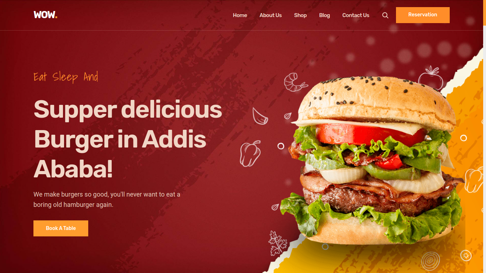
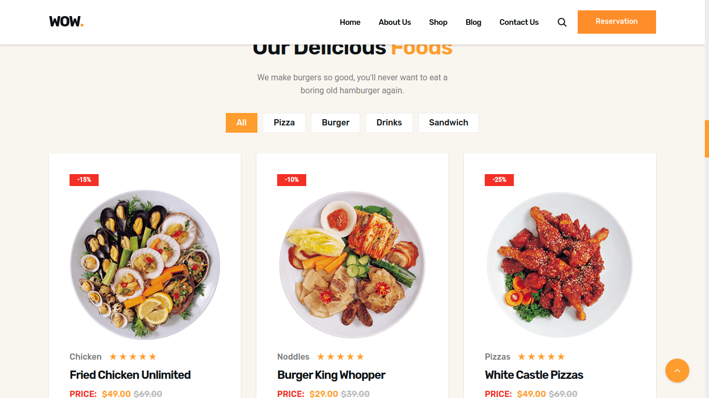
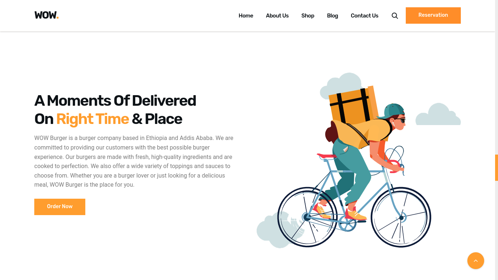

# wow-burger

## WOW Burger Landing Page

This repository contains the code for a landing page for a fictional burger company called WOW Burger. The page is built with React, TypeScript, and Vite. It features a responsive design, a beautiful UI, and a smooth user experience.

### Demo Screeshots

The page includes the following features:

- A hero section with a large image of a burger
- A menu section with a list of all the burgers available
- A contact section with information on how to get in touch with the company
- The page is still under development, but it is already a great example of how to use React, TypeScript, and Vite to build a beautiful and responsive landing page.

# Author

This project was created by Mekuanint Legese.

# Getting Started

To get started with this project, you will need to have Node.js and NPM installed. Once you have those installed, you can clone the repository and run the following commands:

npm install
npm run dev

This will start the development server, which will be accessible at http://localhost:3000.

# Contributing

If you would like to contribute to this project, please feel free to fork the repository and submit a pull request.
